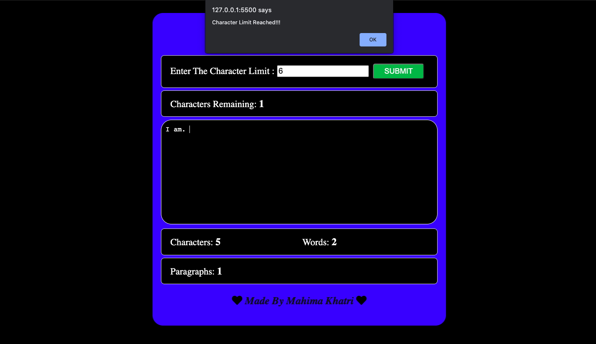

# Word Counter

## Introduction

In this project , a word counter application is being implemented by using html , css and javascript.This application facilitates its user to get information about the number of words and paragraphs in a particular article.

## Features

## Tech Stack

+ HTML
+ CSS
+ JavaScript

## Developers

<table>
<td>

Mahima Khatri

</td>
</tr>
</table>
